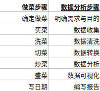

# AQI分析与预测

#### 任务说明

对全国城市空气质量进行研究与分析，希望能够解决如下疑问：

+ 哪些城市的空气质量较好/较差？

+ 临海城市是否空气质量优于内陆城市？

+ 空气质量主要受哪些因素影响？

+ 全国城市空气质量普遍处于何种水平？

+ 是否可以预测城市是否临海？

#### 数据集描述

获取了2015年空气质量指数集。该数据集包含全国主要城市的相关数据以及空气质量指数。

#### 数据分析流程

##### 基本流程

在进行数据分析之前，需要清楚数据分析的基本流程。

1.明确需求与目的

2.数据收集
+ 内部数据
+ 购买数据
+ 爬取数据
+ 调查问卷

3.数据预处理
+ 数据清洗
  + 缺失值
  + 异常值
  + 重复值

4.数据转换与特征工程

5.数据分析
+ 描述分析
+ 推断分析
+ 数据建模
+ 数据可视化

6.编写报告

#### 理解流程

进行一个类比，比如，现在要做出一道菜肴，那么需要进行怎样的流程呢？

+ 确定做菜
+ 买菜
+ 洗菜
+ 切菜
+ 炒菜
+ 盛菜
+ 写日期

接下来，可以将做菜的流程步骤去对应理解数据分析的步骤。

